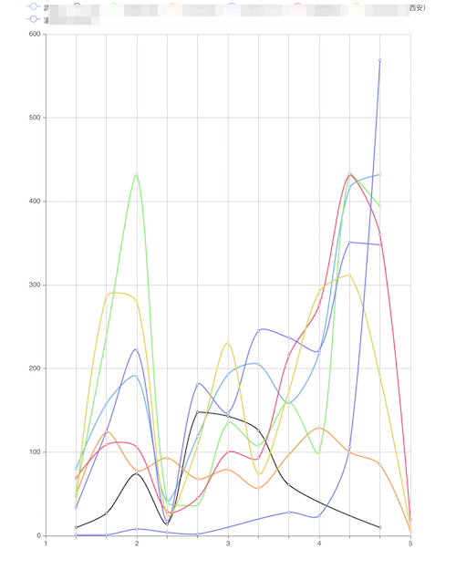
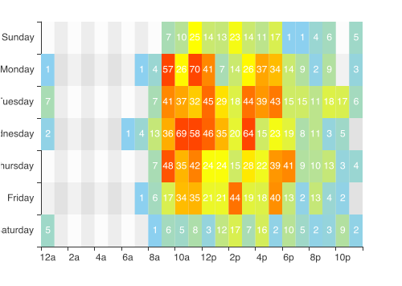

# 微信群聊记录分析

## Usage

首先要从已root的Android手机上获取数据库`EnMicroMsg.db`并且解密。可参考 [wechat-dump](https://github.com/ppwwyyxx/wechat-dump) 的前面几个步骤。（如果仅仅使用 wechat-dump 中的 `decrypt-db.py` 进行解密，安装 `pysqlcipher` 就足够了，文档中列出的其他依赖不需要安装。）

本程序需要 node.js 环境运行，因为要在本地生成图表，要求系统安装有 [cairo](https://www.cairographics.org/) 库，依赖安装方法参见 [node-echarts](https://github.com/suxiaoxin/node-echarts) 的 Install 说明。Cairo等依赖安装好后，执行下面命令完成安装：

```
npm install
```

**本项目仅仅为原型，并非通用工具**，因此实际使用时需要修改源码。部分参数需要自行使用 SQLite view 从数据库中找到。

将解密后的文件`decrypted.db`拷贝到本项目根目录，运行 `node src/index.js` 将分析数据生成多个图片在`output`目录中。要分析的群聊ID在`ROOM`常量中指定。

### Example

发消息最多用户，按每旬统计



某个用户的发消息时间分布



### Known Issue

由于node-echarts没有释放资源，程序执行完后不会退出，需要 ctrl-c 退出。

## Detail

群聊记录都在`message`表中。
- `type`为消息类型，观察到出现过的消息类型包括：
  - 1 － 文字
  - 3 － 图片
  - 43 － ？
  - 47 － 表情
  - 49 － 转发
  - 10000 － 撤回
  - 268435505 － app消息
- `content`为消息内容，包括用`:`分隔的发言者id和内容，内容格式根据消息类型不同，对于文字类型就是纯文本。

联系人记录在`rcontact`表，主要字段有`username`, `nickname`。记录中包含微信用户（人）、公众号，好像还有应用、小程序和群，没有仔细看。无论是否已加为好友，只要出现过的人都会列入。

群的信息记录在`chatroom`表。

用户在每个群聊中可以设置群昵称，群昵称存放在BLOB字段`roomdata`中。网上搜索找不到关于这个字段的信息，自己大概分析了一下，是 username 和群昵称一对一对的排练，中间夹杂着其他一些数据，名字都是UTF-8编码，前面有一个byte表示长度（字节数）。格式大概是这样：`0A xx 0A nn <username> 12 nn <nickname> 18 <other_data>`，但是没能找到完全符合的规律，`0A`不能作为username起始的依据。程序中通过搜索`0A xx 0A`模式来定位username，有可能会跳过了某些用户名，因为出来数据似乎没问题就没有深究了。
